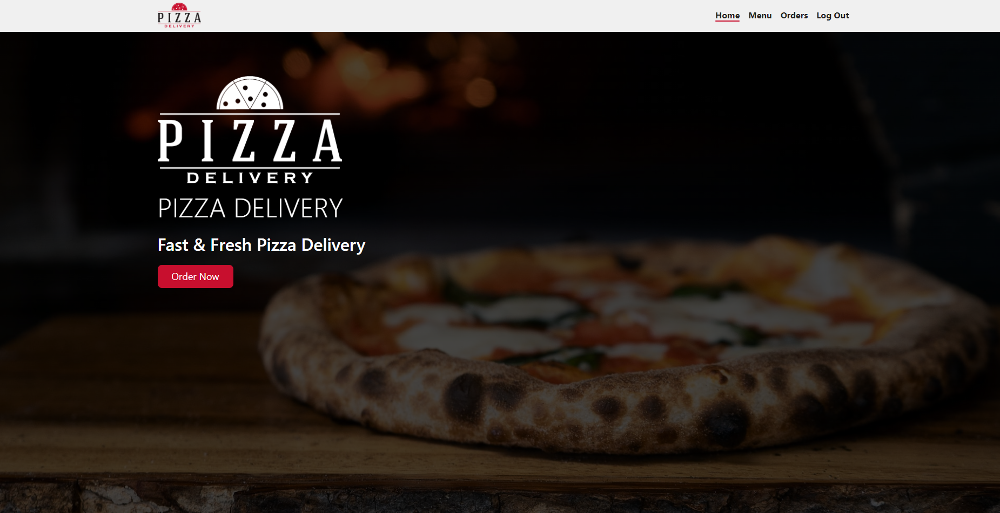

# Pizza Delivery Project

An E-Commerce website for ordering Pizza Online

## Demo

    

## Tools used

1. React: To create the Single Page App
2. React-Router: For Routing
3. Redux: For State Management
4. Firebase: As a DataBase

## How to Use

To use the project follow the steps given below:

1. Install the necessary modules (`npm install`).
2. Setup Firebase Project and configuration
3. Use `npm start` to run the react app
